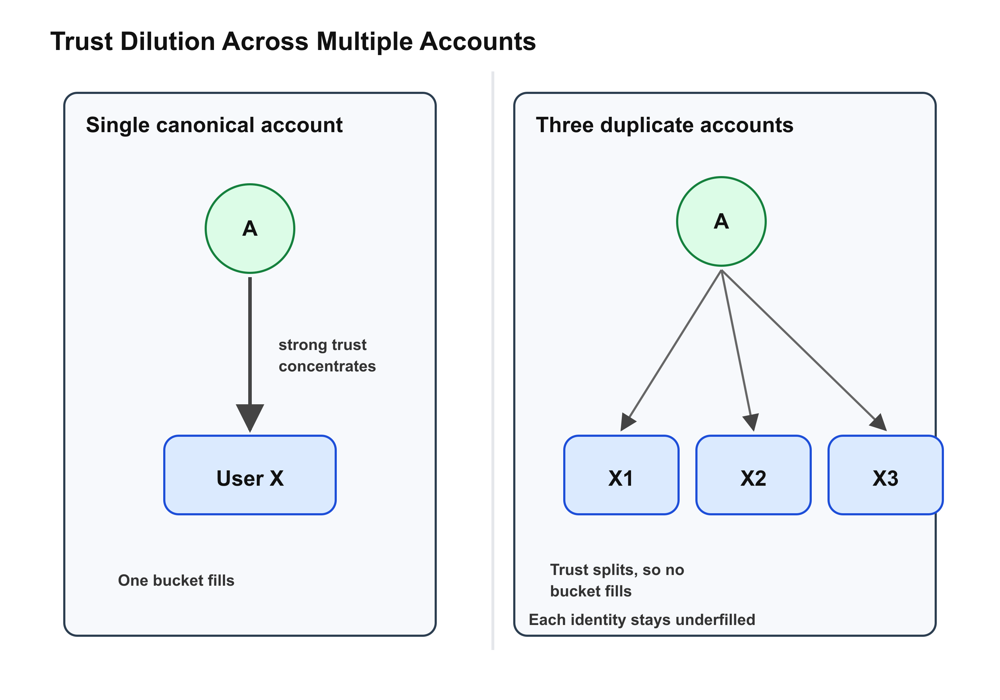
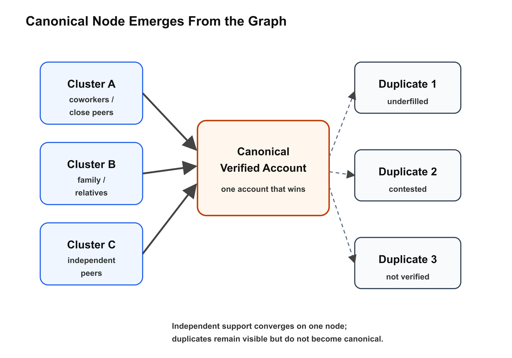
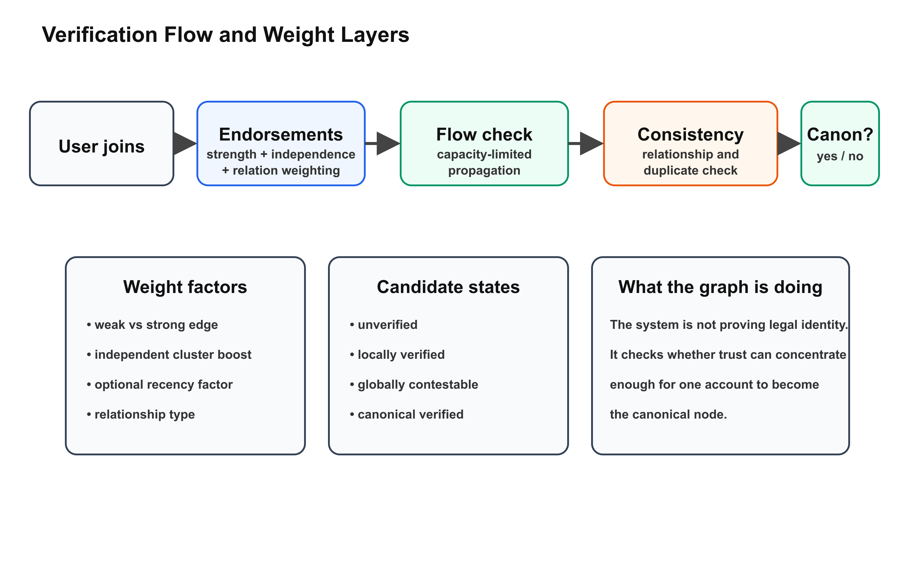
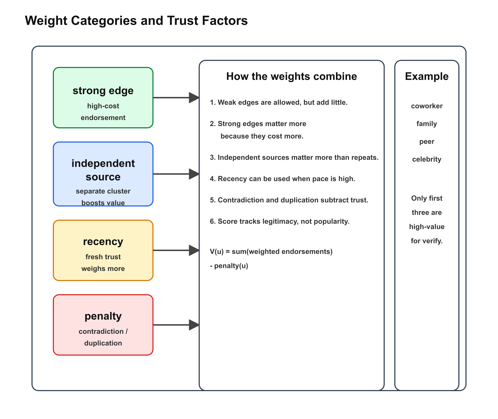

# Introduction

Platforms increasingly want one account per person, yet many users do not want to submit government IDs or other centralized credentials. That tension creates a technical problem and a policy problem at the same time. The technical problem is whether a distributed community can support meaningful verification without a central identity authority. The policy problem is whether such a system can preserve privacy, avoid exclusion, and still resist duplicate accounts, impersonation, and Sybil-style abuse. This paper argues that identity can be modeled as a constrained graph property rather than a fixed profile attribute. Its main contribution is a theoretical framework for one-account-per-person verification built from trust flow, controversy awareness, and relationship consistency. The research gap is that existing trust systems mostly answer who is trustworthy, not which account corresponds to a single real person and only that person.

# Background

## Advogato and flow-based trust
Levien's Advogato work is the conceptual anchor for this paper because it treats trust as something that must move through a network of limited capacity rather than as a simple count of approvals [@levien1998attackresistant; @levien2009attackresistant]. In that framework, trust is not a popularity contest. It is a constrained flow problem: endorsements must travel through bottlenecks, and bottlenecks make mass abuse harder to scale. That is useful for resisting spam and broad trust inflation, which is exactly why the model is so often cited in later reputation research. But the original Advogato idea does not directly answer a harder identity question: whether a verified node is the only node for a single human. It helps decide who is trusted, but not whether trust itself is being split across duplicate identities.

## Extended Advogato / maximum-flow trust discovery
The later group-trust literature extends this insight by using capacity-first maximum-flow reasoning to improve discovery of reliable users while reducing malicious access [@aloufi2012grouptrust]. The important theoretical move here is that trust is not judged only by who says yes, but by whether there are enough independent and structurally credible paths supporting that yes. For this paper, that means identity verification can be framed as a flow-allocation problem. Credible trust has to come from somewhere, and it cannot be duplicated for free across infinitely many accounts.

## MoleTrust and local trust
The controversial-users literature shows that global reputation scores fail when the community does not agree on a single value for a person. Massa and Avesani demonstrate this directly on Epinions data: some users are trusted by many and distrusted by many, so a single global number cannot describe them well [@massa2005controversialusers]. Their work motivates local trust metrics, which preserve disagreement rather than collapsing it away. This is essential for the present paper because a one-account system must still allow a real person to be disliked, debated, or distrusted without being treated as nonexistent. The key lesson is that trust is not one-dimensional and that local trust can be more informative than a single global score.

## Hybrid trust models
Hybrid trust models are useful because they try to balance personalized local trust with broader reputation effects [@josang2007survey]. That hybrid framing helps avoid two failures at once: the tyranny of the majority and the fragmentation of echo chambers. For identity verification, the implication is that a user should not be reduced to global popularity alone or to the approval of a single clique. Instead, the system should ask whether the user has enough independent local support to justify global legitimacy.

## eBay-style global reputation
Simple global reputation systems such as eBay-style feedback are useful as a contrast because they are easy to compute but structurally shallow. A ratio like trust over trust plus distrust can summarize sentiment, but it collapses nuance, controversy, and context. That makes it a useful failure case for this paper: popularity can be measured, but personhood cannot be reduced to popularity.

## PGP web-of-trust usability lessons
Whitten and Tygar's critique of PGP shows that cryptographic trust can fail when ordinary users cannot understand the workflow [@whitten1999johnny]. Their key point is that usable security is still security: if the interface is too confusing, the mechanism does not work in practice. That lesson applies directly here. A theoretically strong trust model is not enough if users cannot tell why an account is verified, disputed, or rejected. Any proposed verification system must therefore be explainable, auditable, and human legible.

## Research synthesis
Taken together, these works suggest a design space that is broader than any one paper alone. Advogato contributes capacity-limited trust propagation. The controversial-users literature contributes locality and disagreement-awareness. Hybrid models contribute a way to balance subjective and global views. PGP contributes the warning that trust systems must be intelligible to users. Reputation systems like eBay contribute a simple baseline that the proposed framework can intentionally surpass.

## Formal trust definitions and evaluation baselines
To keep terminology precise, this paper distinguishes global and local trust in the standard way. A global trust metric is a function $T_g : U \rightarrow [0,1]$, where each user receives one community-wide score. A local trust metric is a function $T_l : U \times U \rightarrow [0,1]$, where trust is observer-dependent. This means two users can evaluate the same target very differently without either evaluation being invalid.

Trust statements are explicitly subjective. If $T(A,B)=0$, user $A$ fully distrusts $B$; if $T(C,B)=1$, user $C$ fully trusts $B$. Inferred trust then becomes a path question: if $A$ trusts $B$, and $B$ trusts $C$, what confidence should $A$ assign to $C$, and how quickly should that confidence decay over longer or redundant paths?

As baselines, simple global formulas such as eBay-style trust,

$$trust_{ebay}(u)=\frac{\#trust(u)}{\#trust(u)+\#distrust(u)}$$

and controversiality,

$$controversiality(u)=\frac{\#trust(u)-\#distrust(u)}{\#trust(u)+\#distrust(u)}$$

help show where global aggregation works and where it fails. For empirical validation, leave-one-out evaluation is useful: hide a known trust edge, run the metric, and test whether the model reconstructs that relationship with high rank. PageRank-style centrality can also be used as a comparison baseline, but unlike flow-limited trust metrics it does not directly encode finite endorsement capacity.

# Problem Definition

The target is a platform in which one account should correspond to one real person. That problem has to be separated into several distinct questions. Identity uniqueness is not the same thing as trustworthiness. Being real is not the same thing as being liked. Being locally trusted is not the same thing as being globally accepted. The threat model therefore includes Sybil attacks, impersonation, collusion, duplicate accounts, and relationship forgery. The key platform assumption is that the system should not require government ID, but still needs to avoid one person operating several accounts under the same apparent social footprint. This also means verification must be distinguished from surveillance: the goal is not to expose legal identity, but to make duplicate or impersonated accounts structurally difficult to sustain.

# Key Failure of Existing Systems

## Global reputation cannot represent controversial people
One of the central failure modes in trust research is that a single global score hides disagreement. A user may be trusted by one cluster and distrusted by another, and a single score turns that structure into a false binary where a person is either good or bad instead of context-dependent and relationship-specific.

## Pure local trust does not prove uniqueness
Local trust can say who trusts whom, but not whether one human is creating several identities. A local network can strongly endorse a cluster while still being vulnerable to Sybil multiplication inside that cluster.

## Centralized verification weakens privacy
Government IDs and similar systems may solve uniqueness, but they create surveillance and exclusion risks. Centralization also raises failure-of-access concerns: if the authority is unavailable, biased, or compromised, the identity system collapses with it.

## Usability failure breaks security
If verification is too complex, people will misuse it, ignore it, or bypass it. A system that cannot be explained to ordinary users will not earn adoption even if it is theoretically sound.

# Literature-Based Design Principle

The strongest design pattern across the literature is not a single score, but a constrained trust graph. The system should use propagation, locality, and capacity limits together rather than relying on reputation alone. For this paper, trust should be treated as a scarce endorsement channel that must be justified by real interaction and independently supported paths.

# Proposed System: Graph-Based Human Verification (GHV)

## Core idea
The proposed system, Graph-Based Human Verification (GHV), treats identity as an emergent property of graph structure. A user is not verified by a single credential. Instead, the user is verified by surviving structural consistency checks across a trust network. The system therefore answers a narrower question than civil identity registries: is this account plausibly a single real person, and can the community maintain that claim without an outside identity authority?

## GHV in one paragraph
GHV can be summarized as: collect trust evidence, constrain how much strong trust can be issued, test whether support comes from independent parts of the graph, penalize contradictions, and then compare competing accounts that appear to represent the same person. The output is not "true identity" in a legal sense. The output is structural believability: which node can credibly function as the community's canonical account for one person.

## Trust as finite resource
Trust is not infinite in the social sense. The model assumes that strong, meaningful trust is scarce, costly, and limited by human time, social risk, and attention. A person can casually interact with many accounts, but they cannot deeply verify or strongly vouch for an unlimited number of identities. If one trusted person endorses many accounts, their effective trust must be divided among them. This makes fake account farms weak because each added identity competes for the same finite trust budget. Weak trust and strong trust are not the same thing: likes, follows, and low-stakes interactions may be plentiful, but verification-grade trust is scarce. This is the paper's key theoretical assumption: the number of meaningful high-confidence endorsements a person can issue is bounded by social reality.

## Why finite trust helps without identifying the attacker
The system does not need to know which accounts belong to the same human. It only needs to observe whether trust can concentrate enough to make one identity believable. Multiple accounts force trust to spread across several nodes, which prevents any single node from accumulating enough support to appear uniquely real. In that sense, the system detects impossible trust distributions rather than ownership. The question is not who created these accounts, but which account can survive structural scrutiny as the canonical node? This also aligns with the Advogato intuition: scarce trust resources should flow toward nodes that are structurally supported, not merely self-asserted.

## One-account constraint
The system assumes one account per human, but it cannot know that at the start. Instead, it watches for multiple accounts that appear to draw from the same trust source, the same social cluster, or the same relationship claims. Competing accounts should not both achieve full verification unless independent evidence supports them. The canonical node is the account that gathers enough independent, high-quality trust to become the primary verified identity for that person. Other accounts, if they exist, remain underfilled, contested, or unverified. This allows the paper to frame identity uniqueness as an outcome of trust concentration rather than as a priori proof. In other words, the system does not ban duplicates from existing; it makes it hard for duplicates to become equally legitimate.

## Duplicate-account thought experiment
The mechanism becomes clearer with three scenarios:

1. **Split trust across accounts.** If peers distribute support across $A$, $B$, and $C$, each account accumulates weak partial evidence and none reaches canonical threshold.
2. **Trust all accounts equally.** If many users endorse all three accounts with nearly identical patterns, the system sees a low-information, high-correlation cluster, a typical Sybil-like signature.
3. **Converge on one account.** In practice, most users eventually endorse one account as the practical reference identity; that account concentrates independent trust and becomes canonical.

This is the core claim: multiple accounts force trust dilution or suspicious symmetry, while canonicalization requires concentrated, independent support.

## Multi-perspective identity validity
This model also preserves multi-perspective identity validity. A user may be verified in cluster A but not verified in cluster B, which handles controversial users without collapsing the system into a binary good or bad label. Verification is therefore contextual, but uniqueness is still globally constrained. This is where the paper draws directly from MoleTrust and hybrid trust models: the same person may hold different trust states across communities, but still need to resolve to one canonical account overall.

## Relationship consistency constraints
Users may also claim relationships such as friendship, family ties, or genealogical links. Those claims must remain consistent with the wider graph. Conflicting relationship claims lower confidence and trigger review. If the system is used for a genealogy-like platform, the graph can additionally check whether claimed kinship paths are mutually compatible rather than contradictory.

## Relation types and evidence collection
Relationship edges should carry explicit types because not all social ties offer equal verification value. Useful examples include: coworker, classmate, project collaborator, family member, close friend, long-term online peer, organizer/moderator relationship, mentor/mentee, and neighbor or local-community contact. The system should avoid binary "friend/not-friend" modeling and instead store relation class, confidence, and optional freshness metadata.

Evidence can be gathered through a layered process:

1. **Self-declared relation claims.** Users can propose relation edges and relation type labels.
2. **Counterparty confirmation.** A relationship claim is provisional until the other account confirms or rejects it.
3. **Context evidence.** Optional signals such as co-membership history, repeated interaction, or shared project/event participation can raise confidence.
4. **Community challenge path.** Third parties can dispute suspicious claims with reason codes (impersonation, contradiction, impossible chronology).

A practical approval rule is "confirm + no critical contradiction" for low-risk relation types, and "confirm + independent corroboration" for high-impact relation types (e.g., family or long-term coworker edges that heavily influence canonicalization).

## Hybrid local + global trust score
Local trust measures whether a nearby community vouches for a user. Global structure measures whether the user is uniquely embedded in the graph. A user may be trusted locally but still fail identity uniqueness checks. This hybrid design is the paper's main addition to prior work: local trust supports subjectivity, while global structure protects uniqueness.

## Verification states
The system should not reduce verification to a simple yes or no. Instead, it should produce states such as unverified, locally verified, globally contestable, globally verified, and revoked or duplicated.

## Thresholds for canonical node selection
Canonicalization should be thresholded, not binary by default. One useful policy structure is:

- **Local threshold $\tau_l$**: minimum score for locally verified status within a cluster.
- **Global threshold $\tau_g$**: minimum score for platform-level canonical candidacy.
- **Independence threshold $\tau_i$**: minimum number (or weighted count) of independent trust sources.
- **Separation margin $\Delta$**: score gap required between the top candidate and next candidate in a duplicate cluster.

An account becomes canonical only when all criteria pass: $V(u)\ge\tau_g$, independence passes $\tau_i$, and the candidate beats alternatives by at least $\Delta$. If criteria are partially met, the account remains "locally verified" or "globally contestable" until more evidence arrives. This avoids overconfident early locking.

## Verification algorithm, conceptually
Conceptually, the verification algorithm works as follows. A user joins with a claimed identity and optional relationship claims. Nearby trusted users provide limited-capacity endorsements. The system propagates trust through the network with decay and capacity limits, then checks whether the account has enough independent support. It compares the account against competing or duplicate claims and validates relationship consistency against the rest of the graph. Finally, it assigns a verification state rather than a simple yes or no answer and periodically re-evaluates the account, since trust should degrade, update, or strengthen over time rather than remaining static.

## Why this helps with multiple accounts
If a human creates several accounts, their trust endorsements must split. Each extra account weakens the others unless outside, independent trust is obtained. The system therefore treats trust like a scarce verification currency. For example, if one real person is represented by three accounts and their strongest endorsers must divide attention across all three, then each account receives less concentrated support than a single canonical account would. The result is not immediate detection, but structural under-verification. That is enough to prevent duplicate identities from all reaching full legitimacy at once. This is the paper's most important practical claim: duplication can be discouraged without ever needing direct proof of duplication.

## Why this helps with real-but-hated users
A person can be real and still distrusted. The system should preserve existence without forcing popularity. Controversiality becomes a feature of the graph, not a failure of the model, which preserves room for disagreement and keeps local trust metrics valuable.

# Canonical Graph View

The central move in this paper is that a user does not become verified because they exist, claim to exist, or even because several people casually recognize them. A user becomes verified when the graph itself stabilizes around one canonical node. That is the account that most strongly and most independently absorbs trust. Everything else is allowed to exist, but it does not get to pretend that it is equally established.

This is important because real communities do not work like a simple yes/no switch. People know celebrities, coworkers, relatives, close friends, weak acquaintances, and complete strangers in completely different ways. That means trust is naturally scarce in the high-value sense. Everybody may know the same public figure, but very few people can honestly claim a coworker-level, sibling-level, or parent-level relationship with that person. In the graph, that scarcity matters. If trust is tied to high-quality, socially costly endorsements, then broad familiarity does not equal deep verification.

So the canonical graph view says this: duplicates can appear, but only one node can prevail as the verified identity. The others remain in the graph as unresolved or underverified candidates. They are not erased. They are simply not allowed to become the canonical account until the structure supports them. That is the entire point of making identity emerge from trust rather than from a self-declared name tag.

# Weight Model and Trust Parameters

The model needs weights because not all endorsements mean the same thing. A weak edge is cheap. A strong edge is expensive. A casual follow is not the same as a real-world vouch. A coworker endorsement is not the same as a distant online interaction. And an endorsement from a person who is already deeply embedded in the same small cluster should count less than an endorsement from an independent cluster.

In other words, trust is not one number. It is a stack of factors. A simple way to express that is:

$$V(u) = \sum_{e \in E_u} w(e) - \lambda P(u)$$

where $V(u)$ is the verification score, $w(e)$ represents the product of weighted factors (strength, independence, relation type, and optionally recency), and $P(u)$ is the penalty for contradictions or duplicates.

Recency does not need to be mandatory in slow-paced communities. In domains where trust-relevant interactions occur infrequently (for example genealogy or long-cycle professional communities), the model can disable or heavily down-weight recency to avoid penalizing legitimate but low-frequency relationships.

The point is not the exact formula. The point is the logic behind it:

- $w_{strength}$ says whether an edge is weak or strong.
- $w_{independence}$ says whether the endorsement comes from a genuinely different part of the graph.
- optional $w_{recency}$ can be used when interaction pace is high enough to make freshness meaningful.
- $w_{relation}$ says what kind of relationship supports the edge.
- $P(u)$ says the system should punish contradiction rather than ignore it.

This is also how the model stays realistic about celebrities and public figures. Lots of people can know a celebrity, but that does not create the same trust value as being a coworker, sibling, parent, or close peer. The graph should reflect that difference instead of pretending all social contact is equal.

## Suggested weight categories

- Weak social contact: low weight
- Active interaction: medium weight
- Strong personal relationship: high weight
- Independent cluster confirmation: multiplier boost
- Same-cluster repetition: diminishing returns
- Contradiction or duplicate pressure: penalty

## Duplicate Handling and Canonicalization

Duplicate accounts should not be treated as a problem only after they are proven. The model should allow them to exist while forcing them into competition. That means several accounts may be present in the graph at once, but only one should be able to cross the threshold into canonical status. This is a useful distinction because it separates account existence from account legitimacy.

The deduplication mechanism works like this. If several accounts are linked to similar trust sources, similar relationship claims, or a suspiciously similar neighborhood structure, they are grouped into a candidate set. That candidate set does not automatically get deleted. Instead, the system waits to see which account accumulates enough independent support to become canonical. If none of them do, the system keeps them in a contested state. If one does, the others remain visible but unverified.

That is a cleaner way to think about one-account-per-person than trying to outlaw duplicates at the front door. The graph does not need perfect certainty about ownership. It only needs enough structural evidence to decide which node deserves to represent the person at the platform level.

## Trust Propagation and Pseudocode

The following sketch shows the basic logic. It is not meant to be a production algorithm. It is meant to make the paper's idea concrete.

Pseudo-steps:

1. For each user $u$, collect direct endorsements $E_u$.
2. Initialize $score_u \leftarrow 0$.
3. For each endorsement $e \in E_u$:
   - Add strength: $score_u \leftarrow score_u + strength(e)$
   - Apply independence factor.
   - Apply recency factor.
4. Subtract contradiction penalty.
5. If duplicate signals are present, place $u$ in a candidate cluster.
6. Assign state:
   - Canonical verified, if score is above canonical threshold and independent support is sufficient.
   - Locally verified, if score is above local threshold.
   - Unverified, otherwise.

The important thing here is that the score is not just about raw quantity. The model insists on independent support, because that is what keeps trust from being inflated by one person, one clique, or one duplicate farm.

## Visual Summary

{width=100%}

{width=100%}

{width=100%}

{width=100%}

# Theoretical Analysis

## Expected strengths
GHV should be stronger than simple reputation scores against Sybil attacks because it makes trust concentration costly. It should also handle controversial users better than global trust alone, and it should preserve more privacy than government-ID-based verification. A further advantage is explanatory power: it offers a clear way to explain why one verified identity should emerge even when account creation itself cannot be prevented. That creates a direct bridge between trust research and identity verification research, which is unusual and helps make the paper original.

## Expected weaknesses
The model is not magic. Collusion can still inflate trust locally, new users may face a cold-start problem, and small communities may overfit identity judgments. False negatives may exclude legitimate users with weak social connectivity. The finite-trust assumption also weakens when large groups coordinate, when endorsements are cheap, or when users do not act independently. For that reason, the model works best as a verification framework rather than an absolute proof of personhood. Relationship-heavy systems may also over-privilege socially connected users, so the paper should explicitly address fairness and access.

## Conceptual evaluation criteria
The proposal should be evaluated by uniqueness resistance, controversy tolerance, collusion resistance, privacy preservation, usability, graph consistency, interpretability by ordinary users, and stability over time.

## Suggested comparison dimensions
It is also worth comparing the system on practical questions: can it prevent one person from appearing as multiple equally verified accounts, can it preserve controversial but legitimate users, can it avoid forcing government ID, can a normal user understand why a verification decision happened, and can trust decay or update over time?

# Handling Edge Cases

The paper should explicitly discuss edge cases such as users with no social ties, real but disliked users, users who are related to others but not publicly known, two accounts that plausibly belong to one human, legitimate users entering from a brand-new community, malicious users trying to borrow trust from a popular cluster, users whose social graphs are fragmented across multiple communities, and two accounts that are both plausible until more independent trust arrives.

# Ethical Implications

There are also serious ethical risks. A trust-based system can exclude isolated or marginalized users, reproduce social hierarchies inside the platform, or make false claims of personhood if it becomes overconfident. It therefore needs appeal mechanisms, transparency, and user understandability. The paper should also argue clearly that trust-based verification is only appropriate when the platform needs participation integrity, not legal identity. Otherwise, the system risks becoming a hidden social-credit regime.

# Conclusion

This paper is trying to solve a very specific problem: how to get closer to one-account-per-person without forcing everyone into a government-ID system. The answer is not to pretend the graph can magically know who a person really is. The answer is to make it costly for one human to present several accounts as equally real.

That is why the canonical graph view matters. It turns identity into a structural outcome. It also explains why trust scarcity matters so much. When strong endorsements are limited, independent, and socially costly, the graph naturally pushes toward one account becoming the real reference point while the others stay weak, disputed, or unresolved.

So the end goal here is not perfect certainty. It is durable legitimacy. The system should be good enough to say, with some confidence, that this account is the one the community can actually stand behind. That is a much more realistic goal than pretending the platform can prove legal identity without any tradeoffs. And for the kind of platform this paper is about, that may be the right target.

# Acknowledgements

I would like to thank my Honors Contract advisor, Brian Gormanly, for his support on this project and for highlighting the importance of the "one account per person" problem and decentralized community trust systems.

# References
